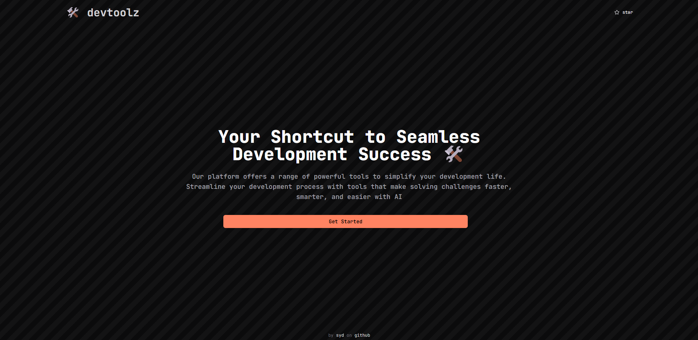

<p align="center">
  
</p>

<p align="center">
  

</p>

<p align="center">
  
  </a>
</p>

# Developer tools to make life easier

## Tech stack

- **Next.js**
- **Modus**
- **Tailwind CSS**
- **shadcn**
- **TypeScript**
- **ESLint**
- **Prettier**
- **Jest**

## Features

- **Regex to natural language converter**
- **Natural language to regex converter**
- **Git command to natural language converter**
- **Natural language to git command converter**
- **SQL query to natural language converter**
- **Natural language to SQL query converter**
- **Vector search with Modus collections**

## Running locally

**NB**: Make sure you set up your backend here before running the frontend
Set up the backend here [https://github.com/y-h-v-h/devtoolz-api](https://github.com/y-h-v-h/devtoolz-api)

- Clone the app and `cd` into the root directory.

```bash
git clone https://github.com/y-h-v-h/devtoolz.git
```

- `cd` into the `frontend` directory and install with `npm` or any other package manager

- Fill the necessary `env` variables using `.env.example`

- Run `npm run dev` to start the app.

- To view the project open `http://localhost:3000`.

## 📝 License

This project is licensed under the MIT License - see the [LICENSE](LICENSE) file for more information.
